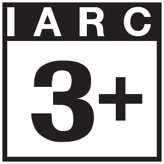
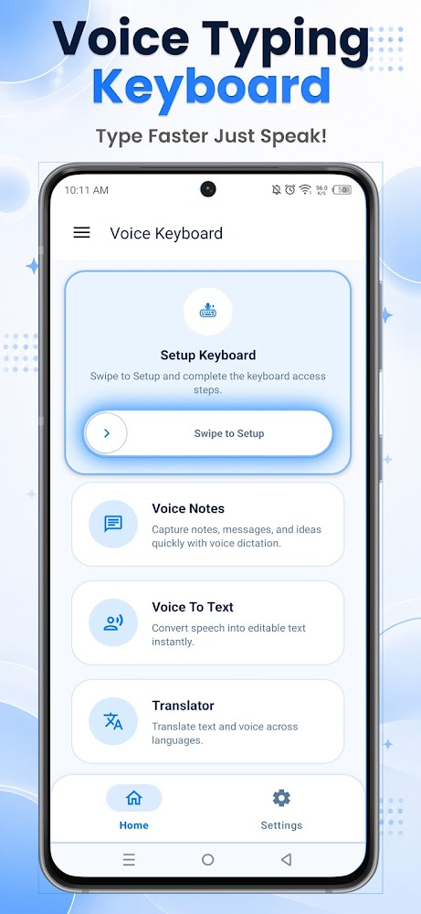
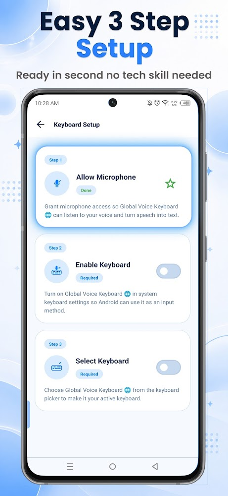
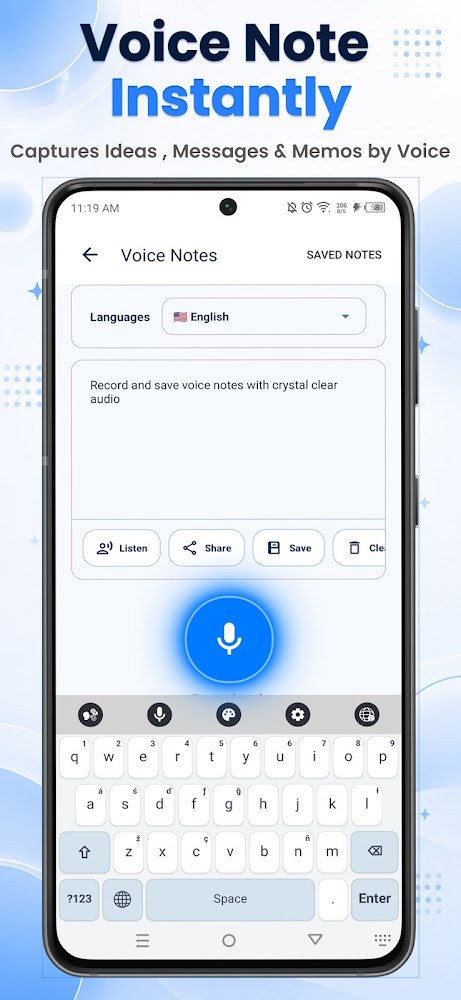
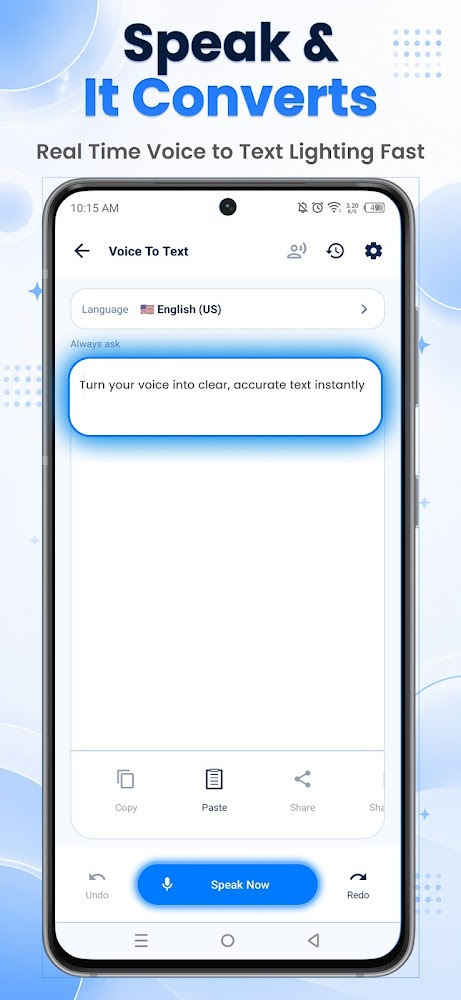
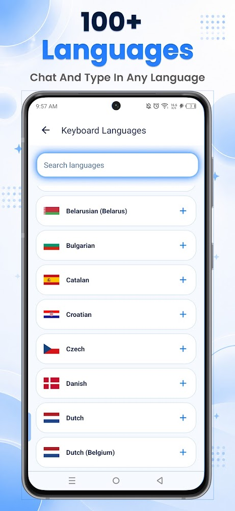

# 🎙️ Voice Typing Keyboard & AI Translator

  
  

This is a premium, high-performance Android keyboard app that I developed during my time at **Zeesoft Tech**. The project was built to solve a simple but frustrating problem: standard mobile keyboards make translation, voice search, and high-speed dictation feel clunky. 

To address this, we designed a beautiful, modern **Glassmorphism UI** and combined it with advanced on-device speech-to-text and offline translation capabilities.

---

## 🔒 Code Sharing & Intellectual Property Notice

Because this app is actively published and holds proprietary commercial value, **the source code cannot be shared publicly** under my employment and confidentiality agreements with **Zeesoft Tech**. 

I have created this repository to showcase:
* The UI/UX styling and design direction.
* The feature set and user experience workflows.
* The architectural design and product scope of what I built.

---

## 🚀 The Features I Developed

### 🎨 Beautiful Glassmorphism UI
Mobile inputs should be fun to use. I implemented a premium "frosted glass" interface featuring smooth translucency and customizable keyboard skins that look stunning on modern high-res displays.

### 🎙️ AI Dictation & Speech-to-Text
No more struggling with tiny on-screen keys. The dictation system uses advanced voice recognition that naturally captures continuous speech, adjusting smoothly to different accents and conversational speeds.

### 📴 Fully Offline Translation
Designed with travelers in mind, I integrated on-device translation support for **over 40 major languages**. Users can translate conversations on the fly even when they are completely off the grid.

### ⏺️ Smart Audio Recorder & Utility Toolkit
We wanted this to be more than just a keyboard. I added a built-in high-fidelity audio recorder so users can seamlessly record meetings, lectures, or quick voice memos without switching apps.

### 🔍 System-Wide Voice Search
Added a super convenient quick-search feature allowing users to trigger voice queries across popular platforms (like YouTube, Google, Amazon, and Reddit) directly from their keyboard.

### 📝 Precision Text Editing
Added dedicated Undo/Redo actions and a unique cursor-precision tool to make editing long texts on mobile devices simple and intuitive.

---

## 🌍 Supported Languages

The app supports 40+ major global languages and regional dialects:
* **English** (US, UK, India, AU)
* **Hindi** (हिंदी वॉयস टाइपिंग)
* **Arabic** (لوحة مفاتيح الكتابة بالصوت)
* **Spanish** (Escritura por voz)
* **French** (Saisie vocale)
* **Portuguese** (Digitação por voz)
* **German** (Sprache zu Text)
* **Japanese** (音声入力キーボード)
* **Urdu** (اردو وائس ٹائپنگ)
* **Bengali** (বাংলা ভয়েস টাইপিং)
* ...and many more!

---

## 📱 App Screenshots

Here is a look at the final user interface, custom keyboard screens, and translation tools that I built:

  
  
  

  
  
  

---

## 🏢 Project Details
* **Role:** Lead Developer
* **Company:** Zeesoft Tech
* **Availability:** Available on the Google Play Store
