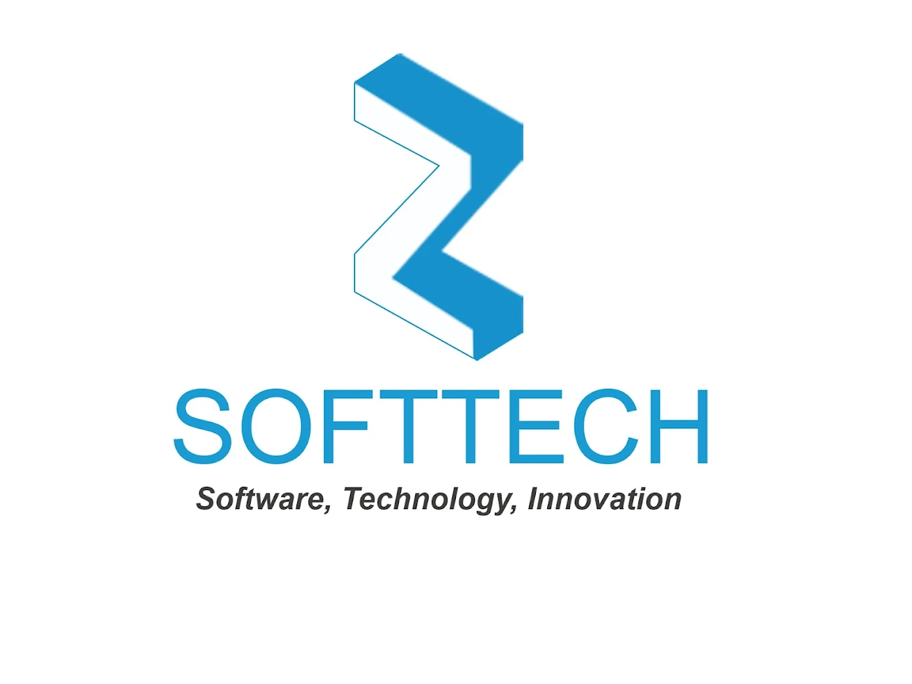
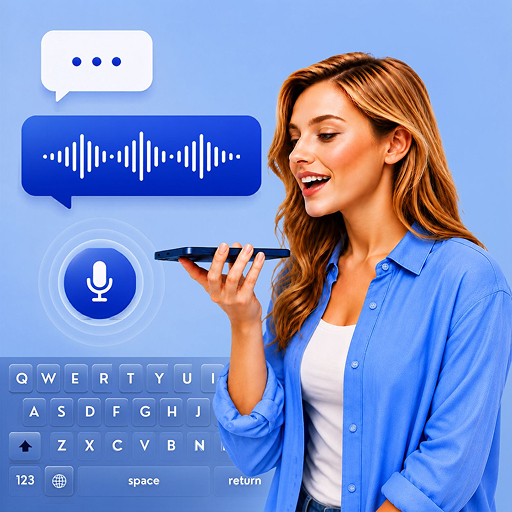
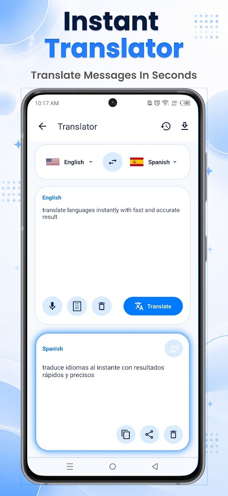

# 🎙️ Multilingual AI Voice Keyboard & Standalone Translator App

  
  

  
  

This is a premium Android application that I developed during my time at **Zeesoft Tech**. 

One important detail to clarify: **this is not just a custom keyboard extension.** While it integrates a powerful system-wide IME (Input Method Editor) keyboard for typing anywhere on Android, it also acts as a **comprehensive standalone utility and productivity app**. The main app houses a full suite of tools—including an offline Translation Center, a professional Audio Recorder, Voice Search engine, and an interactive Theme Customizer.

With **over 50,000+ active downloads** on the Google Play Store, it serves a global user base looking for seamless mobile writing and translation workflows.

---

## 👨‍💻 My Role & Technical Contributions

As the **Lead Android Developer** on this project, I was responsible for taking the legacy codebase and completely revitalizing it. My key contributions included:

* **🎨 Complete UI/UX Redesign (Material 3):** Rebuilt the entire user interface from scratch, replacing legacy screens with Google's **Material 3 / Material You** design system. I implemented dynamic theme adaptations, smooth fluid transition animations, and customizable keyboard skins.
* **⌨️ Redesign & Recreation of the Advanced Keyboard:** Fully re-engineered the core system-wide IME keyboard extension. I improved key responsiveness, latency, and layout structure to make typing more comfortable and fast.
* **🛠️ Rich Feature Integrations:** Successfully introduced new modules into the standalone companion application, including the offline translation engine (supporting 40+ languages), the high-fidelity sound dictation audio recorder, and deep voice search API integrations.

---

## 🔒 Code Sharing & Intellectual Property Notice

Because this app is actively published and holds proprietary commercial value, **the source code cannot be shared publicly** under my employment and confidentiality agreements with **Zeesoft Tech**. 

I have created this repository to showcase:
* The UI/UX styling and design direction.
* The feature set and user experience workflows.
* The architectural design and product scope of what I built.

---

## 🏗️ Architecture: A Dual-Purpose Solution

To provide the best user experience, I designed the product as two integrated components:

### 1️⃣ The Main Standalone Companion App
The main app serves as a centralized hub for productivity. It includes:
* **The Translation Center:** A standalone screen to translate texts and conversations between 40+ languages.
* **The Audio Hub:** A built-in high-quality dictation and sound-recording application to save, manage, and playback voice notes, meetings, or lectures.
* **The Customization Suite:** An interactive panel where users can preview, configure, and install custom Material 3 themes and keyboard skins.
* **Settings & Custom Dictation:** A management screen to configure offline translation packages, voice speed, and dictionary terms.

### 2️⃣ The System-Wide Keyboard Service (IME)
A highly optimized Android Input Method service that integrates smoothly with any app on the device (WhatsApp, Gmail, Chrome, etc.). Users can switch to this keyboard to access AI dictation, instant translations, and custom keyboard styles on the fly.

---

## ⌨️ Core Keyboard Features I Recreated

### 🎙️ Real-Time Voice Typing (Speech-to-Text)
The centerpiece of the keyboard itself. I built a highly responsive voice dictation engine where users can **simply speak and the app transcribes their words into text in real-time**. 
* Supports instant voice transcription for a wide variety of languages and accents.
* Features smart continuous dictation that won't cut off mid-sentence.

### 🎨 Custom Keyboard Themes & Personalization
No more boring stock keyboards. I recreated the appearance suite to support a rich set of **custom theme styles** for the keyboard layout itself.
* Modern layouts designed according to Google's **Material 3** specification.
* Highly customizable colors, styles, and button borders to let users design their own ideal layout.

### 📴 Direct On-Keyboard Offline Translation
Users can type or speak in their native tongue and translate it on the fly directly inside their keyboard before sending, working completely offline without needing an active internet connection.

### 🔍 Quick System Voice Search
A smart shortcut keys layout allowing users to trigger fast voice search queries across YouTube, Google, Amazon, and Reddit directly from their active keyboard interface.

---

## 📂 Standalone Companion App Features

### ⏺️ Pro Audio Recorder Hub
A built-in high-fidelity audio recorder to capture lectures, corporate meetings, and long voice notes with dedicated audio management options directly in the main companion application.

### 📲 Standalone Offline Translation Center
A dedicated translation workspace page in the main app to quickly type or voice-dictate conversations back and forth in 40+ major languages.

---

## 🌍 Supported Languages

The app supports 40+ major global languages and regional dialects:
* **English** (US, UK, India, AU)
* **Hindi** (हिंदी वॉयс टाइपिंग)
* **Arabic** (لوحة مفاتيح الكتابة بالصوت)
* **Spanish** (Escritura por voz)
* **French** (Saisie vocale)
* **Portuguese** (Digitação por voz)
* **German** (Sprache zu Text)
* **Japanese** (音声入力キーボード)
* **Urdu** (اردو وائس ٹائپنگ)
* **Bengali** (বাংলা ভয়েস টাইপিং)
* ...and many more!

---

## 📱 App Screenshots

Here is a look at the final user interface, standalone companion utility screens, and translation tools that I built:

  
  
  

  
  
  

---

## 🏢 Project Details
* **Role:** Lead Developer (UI/UX Redesign & Feature Integration)
* **Company:** Zeesoft Tech
* **Availability:** Available on the Google Play Store (**50K+ Downloads**)
